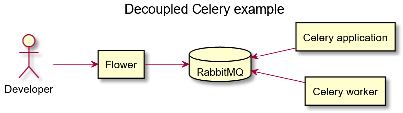

# Celery App POC

Celery, implemented in Python, is an open-source library allowing to run tasks asynchronously. To understand how it works, this POC demonstrates an implementation of celery using Docker containers.

## Containers:
* Application to queue tasks
* Worker to process queued tasks
* Dashboard to see the full list of workers
* Redis as the message broker

## System Diagram


## Pre-requisites

- `docker-compose`
- `make`

## Getting started

```bash
# Use make to run docker-compose
make recompose
```

Access Flower web UI at <http://localhost:8889>
